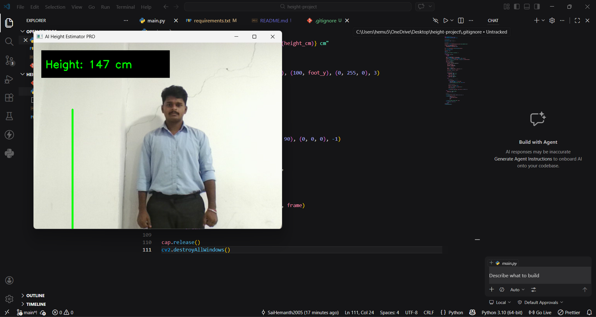

# 🚀 AI-Based Height Estimation System

An AI-powered system that estimates a person’s height using a single camera and computer vision techniques.

---

## 📸 Demo

(Add your screenshot here)


---

## 🧠 How It Works

- Detects human body using MediaPipe Pose
- Identifies key landmarks (head and feet)
- Calculates pixel distance between them
- Converts pixel distance into real-world height using calibration

---

## ✨ Features

- 📏 Real-time height estimation  
- ⚙️ Automatic calibration  
- 📐 Distance validation (move closer / move back alerts)  
- 🧍 Posture & full-body detection  
- 🎨 Clean UI with live feedback  

---

## 🛠 Tech Stack

- **Programming Language:** Python  
- **Libraries:** OpenCV, MediaPipe, NumPy  
- **Concepts:** Computer Vision, Pose Estimation, Image Processing  

---

## ▶️ How to Run

1. Clone the repository:
```bash
git clone https://github.com/SaiHemanth2005/ai-height-estimator.git
cd ai-height-estimator